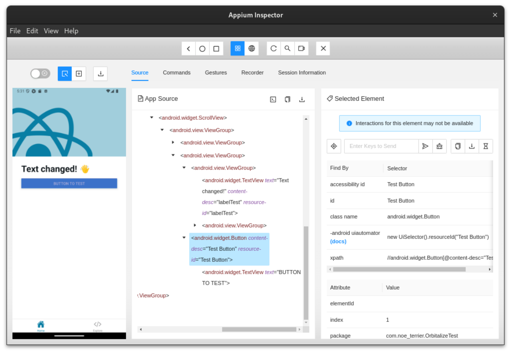

# Welcome to your Expo app 👋

This is an [Expo](https://expo.dev) project created with [`create-expo-app`](https://www.npmjs.com/package/create-expo-app).

## Get started

1. Install dependencies

   ```bash
   npm install
   ```

2. Start the app

   ```bash
    npx expo start
   ```

## Appium

### Installation

1. Install appium:  
`npm install -g appium`

2. Install WebdriverIO, used to convert tests into http request to appium:  
`npm install @wdio/cli --save-dev`

3. Initialize WebdriverIO configuration:
`npx wdio config`
   - On my local machine
   - Mocha
   - No compiler
   - Spect Location: Default
   - Do you want WebDriverIO to generate some test files?: No
   - Reporter: Spec
   - No Plugin
   - Service: Appium
   - Base URL: Default
   - NPM Install: Yes


4. Install dependencies:  
`npm install @wdio/appium-service webdriverio chai`

5. Create a ADV emulator with android studio.

### Set config and write test


1. Build the apk of the app (using eas for example `npx eas build --platform android --local`) 

2. Edit `wdio.conf.js` with capabilities. Replace name and version with the good values.

``` typescript
...
capabilities: [{
   // capabilities for local Appium web tests on an Android Emulator
   platformName: 'Android',
   'appium:device-name': 'Medium Phone API 35',
   'appium:platformVersion': '15',
   'appium:automationName': 'UiAutomator2',
   'appium:app': '/path/to/apk/application.apk', // Path to the React Native APK
   'appium:noReset': true,
}],
...
```

3. Create the test file `test/specs/button.e2e.js`.

It is important for the testID and accessibilityLabel to be set for appium to find the item, or Appium Inspector to naviguate in the app. The inspector is useful to see the hierarchy of the app.



## Run the test

Run the emulator and execute `npx wdio`.